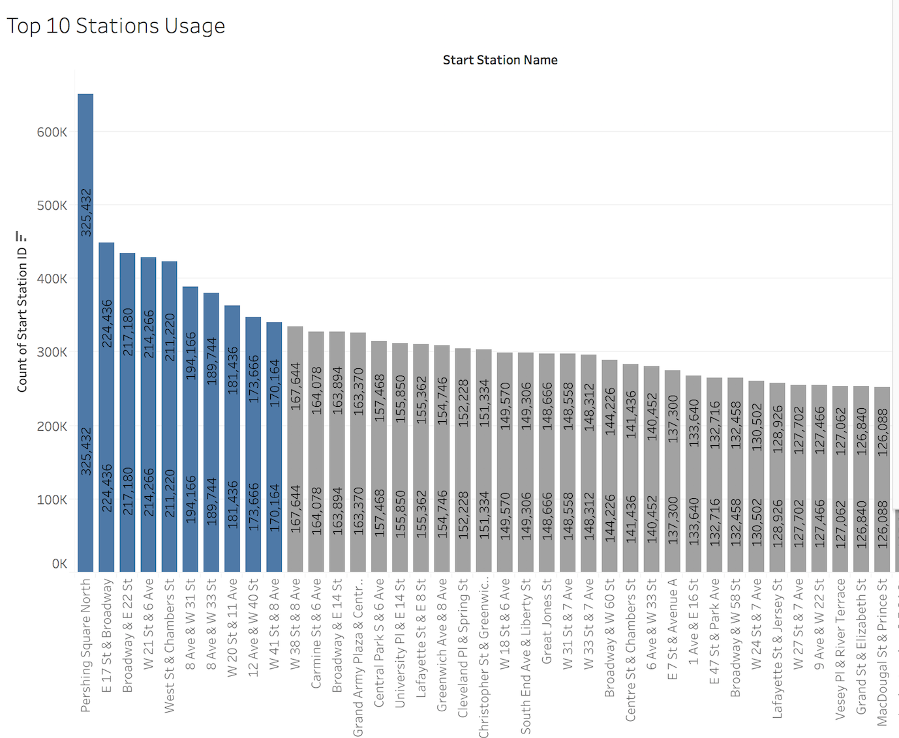

# Tableau Assignment - Citi Bike Analytics

## Background

Since 2013, the Citi Bike Program has implemented a robust infrastructure for collecting data on the program's utilization. Through the team's efforts, each month bike data is collected, organized, and made public on the [Citi Bike Data](https://www.citibikenyc.com/system-data) webpage.

## Analysis

The usage of City Bike in New York increases from January to June in 2017, from Cold weather to Hot weather, especially the marginal change in April was significat when the weather changes the most. We also can see the gender difference between male and female, the male rode more citibik than the femals and the short-term riders are slightly higher than regular subscribers. We also demo the top 10 statstions for citibike riding in New York.

